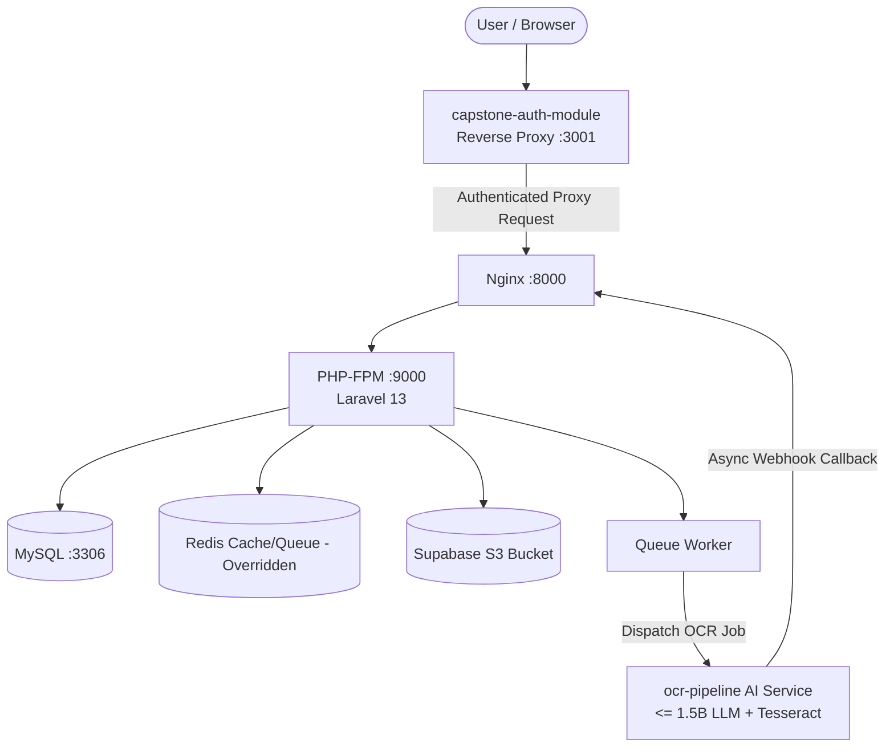
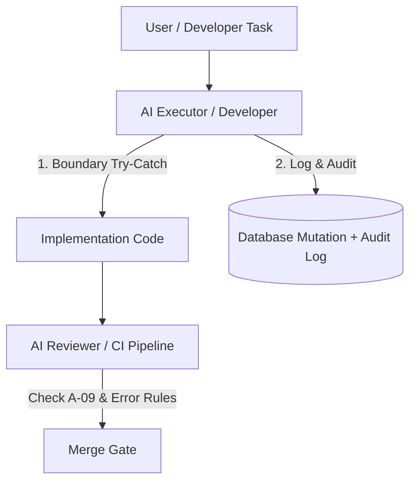

# Software Architecture Document (SAD): Smart Expense & Reimbursement Management System (SERMS)

**Project:** Smart Expense & Reimbursement Management System (SERMS)  
**Client / Partner:** Science Biotech Specialties Inc. (SBSI) — [https://sbsi.com.ph/about-us/](https://sbsi.com.ph/about-us/)  
**Academic Context:** 3rd & 4th Year Capstone Project (Capstone 1: Ended July 2026 · Capstone 2: September–December 2026)  
**Date:** 2026-09-01  
**Version:** 1.5.1  
**Owner:** SERMS Engineering & Architecture Council  
**Status:** Active  
**Last reconciled:** 2026-09-01 (Documentation suite refactor & standardization of 'What this is' sections across all docs)  
**Canonical Spec:** [SERMS.md](SERMS.md) · **Related Docs:** [index.md](index.md) · [PRD.md](PRD.md) · [SDD.md](SDD.md) · [DSD.md](DSD.md) · [Build.md](Build.md) · [OPS.md](OPS.md) · [QAD.md](QAD.md) · [CHANGELOG.md](CHANGELOG.md) · [AGENTS.md](../AGENTS.md)

---

> **What this is:** The Software Architecture Document (SAD) defining the high-level structural blueprint, Modular Monolith architectural pattern, technology stack decisions, cross-system component communications (via `capstone-auth-module` SSO, `ocr-pipeline`, and `capstone-azure-infra`), Service Level Objectives (SLOs), and the AI governance / development execution model.

---

## Part 1: Software Architecture

### 1. Architectural Overview
- **Design Pattern:** Modular Monolith
- **Client & Ecosystem Alignment:** Developed for Science Biotech Specialties Inc. (SBSI) alongside 3 sister sub-systems (CMS, PRS, TS), unified under the `capstone-auth-module` reverse proxy / SSO gateway.
- **Structural Breakdown:** 
  - **Client Application (Frontend):** Vue 3 SPA, high-density dashboard. Communicates with Core API.
  - **Core API (Backend):** Laravel 13 modular monolith. Organizes business domains into isolated modules inside `app/Modules`.
  - **Worker Service:** Handles asynchronous tasks like receipt OCR extraction and daily penalty calculations via Laravel Queues.
  - **Storage Layer:** Relational MySQL DB for transactional data; Supabase object storage for receipt images.
  - **AI OCR Pipeline (`ocr-pipeline`):** Standalone asynchronous external service running Tesseract OCR + lightweight <= 1.5B parameter LLMs for structured metadata extraction.

### 2. Technology Stack & Tech Decisions Register

| Layer | Technology | Version | Status & Alignment |
|---|---|---|---|
| Frontend Runtime | Node / Vue 3 | `^3.4.0` | **Approved / Recommended by SBSI** (matches existing internal systems) |
| Frontend Store | Pinia | `^2.1.0` | Modular client state management |
| Frontend Styling | Tailwind CSS | `^3.4.3` | Utility styling for high-density layouts |
| Backend Runtime | PHP | `^8.3` | Modern features, strong typing |
| Backend Framework | Laravel | `^13.7` | Built-in Queue support, robust MVC/Monolith scaffolding |
| Database | MySQL | `8.0` | **Approved / Recommended by SBSI** (relational transactions for audit logs and ledger) |
| In-Memory Cache / Queue | Redis | `Alpine` | **Status: Overridden** (Containerized in Docker for high performance; fallback to MySQL DB driver configured) |
| AI Pipeline Data Store | MongoDB | `7.0` | **Status: Overridden** (Isolated in `ocr-pipeline` project; zero MongoDB dependencies in SERMS) |
| Object Storage | Supabase Bucket | S3 API | Secure receipt storage and signed URL generation |
| External AI Service | `ocr-pipeline` | HTTP / Webhook | Asynchronous receipt extraction with <= 1.5B parameter model ceiling |
| Cloud Infrastructure | `capstone-azure-infra` | Azure for Students | $100 USD/year student credit allocation |

### 3. Component Communication

### 4. Quality Attributes & SLAs

| Attribute | Strategy / SLO Target |
|---|---|
| **Availability (Uptime)** | 99.5% uptime target for API and client frontend. |
| **Performance (Latency)** | < 300ms p95 response time for standard API endpoints. |
| **Throughput (OCR Speed)** | < 10 seconds for 90% of receipt uploads (from upload to webhook callback). |
| **Reliability (Error Rate)** | < 0.1% overall request error rate. |
| **Security** | Payload pre-encryption on client-side to prevent shoulder theft. RBAC enforced on every route. Standard sessions timeout at 90 minutes; admin/IT sessions timeout at 60 minutes. Concurrent sessions are prohibited. Audit logs are immutable and append-only. |

---

## Part 2: Development & AI Governance Model

### 1. Purpose & Scope

SERMS is a Modular Monolith built with Laravel 13, Vue 3, MySQL, and Supabase. Development operations and AI agent execution are governed directly through canonical workspace rules (`docs/SERMS.md`, `AGENTS.md`, and `.agents/rules/smart-expense-reimbursement-management-system.md`).

AI subagent execution is unified into core agent roles (Executor, Reviewer, Planner) adhering strictly to BIR VAT compliance, append-only audit logging, and `A-09 Fullstack Reusability` guardrails.

### 2. Core Development Guardrails & Principles

Detailed, canonical operational guardrails are defined in **[`docs/SERMS.md`](SERMS.md)**, **[`docs/Build.md` (§5 Development Guardrails)](Build.md#5-development-guardrails)**, and materialized into root **[`AGENTS.md`](../AGENTS.md)**:

1. **Canonical Source of Truth ([SERMS.md](SERMS.md)):** Check `docs/SERMS.md` first before modifying code or downstream docs.
2. **Fullstack Reusability & Anti-Duplication ([Build.md §5](Build.md#5-development-guardrails)):** Scan the codebase for pre-existing components (`src/components/base/`), composables (`src/composables/`), utility helpers, and backend API endpoints/services before creating new ones.
3. **Immutable Auditing & Export Logging ([Build.md §5](Build.md#5-development-guardrails)):** Every database mutation and report export must write an immutable `AuditLogService::log()` entry within the same database transaction.
4. **Robust & Boundary-Scoped Error Handling ([Build.md §5](Build.md#5-development-guardrails)):**
   - **Boundary Try-Catching:** Implement explicit `try-catch` blocks at system execution & integration boundaries (Supabase uploads, Tesseract OCR queue tasks, external HTTP APIs, filesystem I/O).
   - **Zero Error Swallowing:** All `catch` blocks must log actionable error context and either re-throw, map to structured domain exceptions, or return formatted HTTP 4xx/5xx responses.
   - **Transaction Integrity:** Never swallow exceptions inside `DB::transaction()` blocks so database operations roll back atomically on failure.
   - **Centralized Exception Delegation:** Allow unexpected runtime errors to bubble up to Laravel's centralized Exception Handler (`bootstrap/app.php`) or Vue's global error handler.
5. **Client-Side Payload Encryption ([Build.md §5](Build.md#5-development-guardrails)):** Pre-encrypt sensitive PII and financial mutations using AES-256-GCM + RSA wrapper before network transmission.
6. **Database-Driven Analytics ([Build.md §5](Build.md#5-development-guardrails)):** Leverage database aggregate queries (`SUM`, `COUNT`, `GROUP BY`) rather than in-memory math loops.
7. **Git Inspection & Historical Context ([Build.md §5](Build.md#5-development-guardrails)):** Check Git in read-only mode for context (no unapproved write/push actions) and consult **[`docs/CHANGELOG.md`](CHANGELOG.md)** for project evolution history.
8. **Judicious Browser Testing & Interactive Debugging ([Build.md §5](Build.md#5-development-guardrails)):** Use browser testing (`browser_subagent`, DevTools, screenshot and DOM verification) **judiciously and only when strictly applicable** (e.g., complex multi-step flows, visual regressions). Avoid slow browser agent sessions for simple UI tweaks or non-visual logic where faster unit tests suffice.
9. **Proactive Skill & Workflow Ingestion ([Build.md §5](Build.md#5-development-guardrails)):** Actively ingest and leverage applicable skills from `.agents/skills/` (TDD, systematic debugging, planning, verification) before executing specialized tasks.

### 3. Architecture & Execution Flow

### 4. Maintenance

- **`docs/SERMS.md` is the primary master specification and source of truth.**
