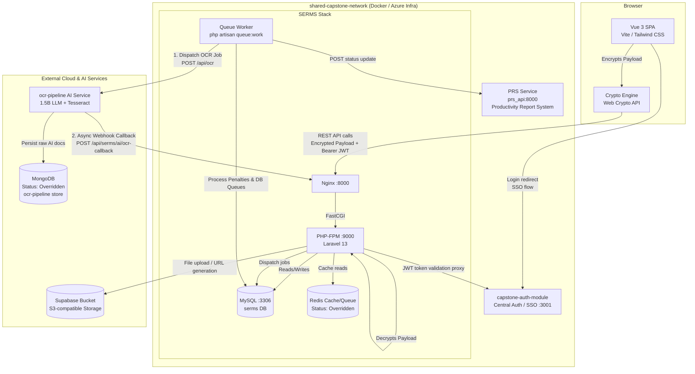
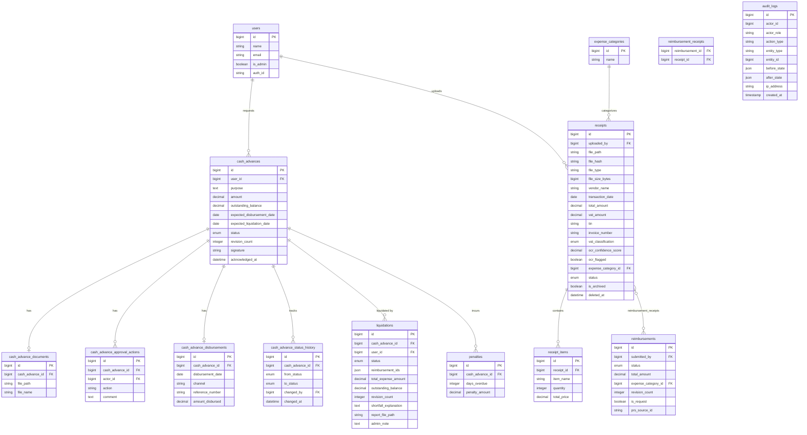
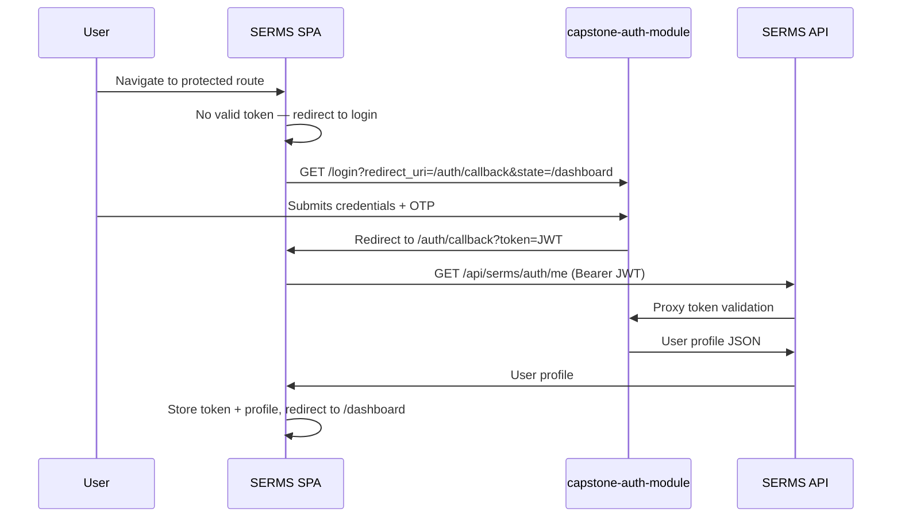
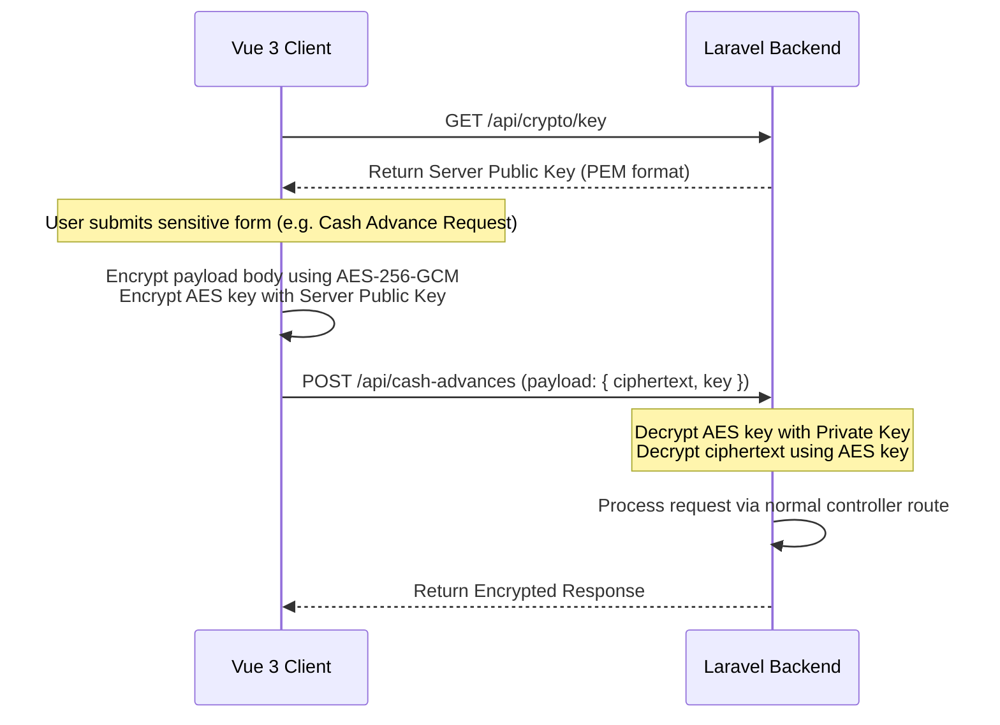
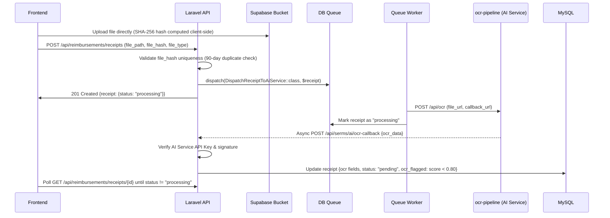

# System Design Document (SDD)

**Project:** Smart Expense & Reimbursement Management System (SERMS)  
**Client / Partner:** Science Biotech Specialties Inc. (SBSI) — [https://sbsi.com.ph/about-us/](https://sbsi.com.ph/about-us/)  
**Academic Context:** 3rd & 4th Year Capstone Project (Capstone 1: Ended July 2026 · Capstone 2: September–December 2026)  
**Date:** 2026-09-01  
**Version:** 1.5.1  
**Owner:** SERMS Engineering Team  
**Status:** Active  
**Last reconciled:** 2026-09-01 (Documentation suite refactor & standardization of 'What this is' sections across all docs)  
**Canonical Spec:** [SERMS.md](SERMS.md) · **Related Docs:** [index.md](index.md) · [PRD.md](PRD.md) · [SAD.md](SAD.md) · [DSD.md](DSD.md) · [Build.md](Build.md) · [OPS.md](OPS.md) · [QAD.md](QAD.md) · [CHANGELOG.md](CHANGELOG.md) · [AGENTS.md](../AGENTS.md)

---

> **What this is:** The System Design Document (SDD) providing low-level engineering specifications for SERMS. It covers the 9 self-contained domain modules (`CashAdvances`, `Reimbursements`, `Expenses`, `Liquidations`, `AuditLogs`, `Notifications`, `Ai`, `Users`, `Shared`), the database entity-relationship schema, client-side pre-encryption protocols (AES-256-GCM + RSA-OAEP), asynchronous OCR pipeline sequence, REST API conventions, and RBAC authorization policies.

---

## 1. Architectural Vision & Principles

**Architecture style:** Modular Monolith (Laravel 13 API + Vue 3 SPA), containerized with Docker, deployed via `capstone-azure-infra`, and integrated into a shared capstone network with `capstone-auth-module`, `CMS`, `PRS` (Productivity Report System), and `TS`.

**Guiding principles:**

- **Module Isolation:** Each domain (CashAdvances, Reimbursements, Liquidations, etc.) is fully self-contained under `app/Modules/{Name}/` with its own controllers, services, models, migrations, and routes. No cross-module imports except through the `Shared` module or explicit model references.
- **Async-First for Heavy Work:** OCR processing, penalty computation, and notification dispatch are all executed via Laravel Queues — never blocking request cycles.
- **Immutable Audit Trail:** Every state mutation in the system writes an append-only record to `audit_logs`. No audit record is ever updated or deleted.
- **Auth Delegation:** Authentication is fully delegated to the external `capstone-auth-module`. SERMS never issues tokens — it only validates JWT tokens issued by the auth service.
- **Storage Separation:** All user-uploaded files (receipts, documents) are stored exclusively in Supabase Bucket via the S3-compatible driver. The local filesystem is never used for user data.
- **Payload Privacy (Shoulder Theft Prevention):** High-sensitivity financial and PII payload data are encrypted on the client side prior to HTTP transmission, protecting information from local memory inspection or network eavesdropping.
- **Database-Optimized Analytics:** Dashboard analytics and reports rely purely on optimized database aggregation queries, avoiding memory-heavy application-level array maps and loops.

**Key trade-offs & client override register:**

- **Client Server & 1.5B LLM Ceiling:** SBSI granted server permission but constrained LLM execution to <= 1.5B parameters. `ocr-pipeline` strictly utilizes lightweight quantized extraction models alongside Tesseract OCR.
- **Client Stack Alignment (MySQL & Vue):** Recommended and approved by SBSI to match their existing internal enterprise tools.
- **In-Memory Cache (Redis) — Status: Overridden:** SBSI did not permit Redis on their host; overridden in containerized Docker for queue acceleration, with an architectural fallback to Laravel's MySQL Database driver (`CACHE_STORE=database`, `QUEUE_CONNECTION=database`) for client turnover.
- **NoSQL Store (MongoDB) — Status: Overridden:** SBSI did not permit MongoDB; overridden exclusively in the external `ocr-pipeline` service for storing raw OCR bounding boxes and AI schemas.
- **External Auth Gateway:** Delegating auth to `capstone-auth-module` eliminates duplicate session management across CMS, SERMS, PRS, and TS at the cost of hard availability coupling with the auth service.

---

## 2. High-Level Architecture



### Stack Components

| Layer | Technology | Version | Responsibility / Client Status |
|-------|------------|---------|--------------------------------|
| Frontend SPA | Vue 3 + Vite | Vue 3.4, Vite 5.2 | SPA routing, state management, API integration (**Approved by SBSI**) |
| Frontend Crypto | Web Crypto API (AES-GCM / RSA) | Native | Client-side payload encryption before transmission |
| UI Styling | Tailwind CSS | v3.4 | Utility-based styling |
| State Management | Pinia | v2.1 | Per-domain stores (auth, cashAdvance, receipts, etc.) |
| Charts | Chart.js + vue-chartjs | v4.4, v5.3 | Dashboard analytics rendering |
| Icons | lucide-vue-next | v0.373 | Icon system |
| API Server | Laravel 13 (PHP 8.3) | 13.7 | Modular Monolith backend (handles decryption via middleware) |
| Web Server | Nginx (Alpine) | — | Reverse proxy + static file serving |
| App Server | PHP-FPM | 8.3 | FastCGI process manager |
| Database | MySQL | 8.0 | Primary relational data store (**Approved by SBSI**) |
| Cache & Queue | Redis (via Predis) | Alpine | In-memory cache & queue (**Status: Overridden**; DB fallback available) |
| File Storage | Supabase Bucket | — | Receipt / document object storage (S3 API) |
| Auth Gateway | capstone-auth-module | External | Central SSO, JWT issuance, OTP, user management |
| OCR AI Engine | `ocr-pipeline` | External | Receipt data extraction via Webhook (<= 1.5B parameter model ceiling) |
| OCR Data Store | MongoDB | 7.0 | Document store inside `ocr-pipeline` (**Status: Overridden**) |
| Cloud Deployment | `capstone-azure-infra` | Azure Student | Deployment orchestrator ($100 USD/year student tier) |

---

## 3. Module Architecture

SERMS follows a **Modular Monolith** pattern. Each module is a self-contained vertical slice of the domain. Modules are registered via their `ServiceProvider`, which binds routes, migrations, and services into the Laravel application.

### Module Layout (Canonical)

```
app/Modules/{ModuleName}/
├── Http/
│   ├── Controllers/{Name}Controller.php
│   ├── Middleware/        (e.g., DecryptPayloadMiddleware)
│   └── Requests/
│       ├── Store{Name}Request.php
│       └── Update{Name}Request.php
├── Models/
├── Services/
│   └── {Name}Service.php
├── Providers/
│   └── {Name}ServiceProvider.php
├── Jobs/              (async work only — OCR, Penalties)
├── Database/
│   └── Migrations/
├── Observers/         (model event hooks)
├── Policies/          (Gate policies)
└── routes/
    └── api.php
```

### Module Roster

| Module | Route Prefix / Namespace | Key Controllers & Services | Key Jobs / Workers | Primary Responsibility |
|--------|--------------------------|----------------------------|--------------------|------------------------|
| `CashAdvances` | `/api/cash-advances`<br>`App\Modules\CashAdvances` | `CashAdvanceController`<br>`CashAdvanceService` | `CalculateOverdueCashAdvancesJob` | Cash advance request lifecycle (submission, policy threshold validation, accounting approval/rejection, disbursement logging, and employee acknowledgment). |
| `Reimbursements` | `/api/reimbursements`<br>`App\Modules\Reimbursements` | `ReimbursementController`<br>`ReceiptController`<br>`ExpenseCategoryController`<br>`PrsReimbursementRequestController`<br>`PrsWebhookController`<br>`OcrCallbackController`<br>`ReimbursementService`<br>`ReceiptService` | `UpdatePrsReimbursementStatusJob`<br>`DispatchReceiptToAiService` | Reimbursement claim lifecycle, multi-receipt uploading & OCR dispatch, 90-day duplicate checking, BIR VAT classification, PRS status sync, and approval workflows. |
| `Expenses` | `/api/expenses`<br>`App\Modules\Expenses` | `ExpenseController`<br>`ExpenseService` | — | Generic expense logging, line-item recording, receipt linkage, and expense category association. |
| `Liquidations` | `/api/liquidations`<br>`App\Modules\Liquidations` | `LiquidationController`<br>`LiquidationOcrCallbackController` | `CalculateDailyPenaltiesJob`<br>`DispatchReceiptToAiService` | Cash advance liquidation reports, receipt item matching & scanning, variance/shortfall computation, accounting audit verification, and daily penalty accruals. |
| `AuditLogs` | `App\Modules\AuditLogs` | `AuditLogService` | — | Centralized append-only audit trail logging (`AuditLogService::log()`) and compliance export action tracking. |
| `Notifications` | `App\Modules\Notifications` | `NotificationDeliveryService` | — | Template-based in-app notification dispatching, failed attempt logging, and role-based hierarchy resolution. |
| `Ai` | `App\Modules\Ai` | `AiServiceOcrEngine`<br>`TesseractOcrEngine` | — | OCR contract bindings (`OcrEngineInterface`, `AsyncOcrEngineInterface`), external OCR service communication, payload signing, and webhook validation. |
| `Users` | `App\Modules\Users` | `User` Model & Providers | — | User identity mapping, department and organizational hierarchy resolution, and role policy checks. |
| `Shared` | `/api/crypto`<br>`/api/auth`<br>`App\Modules\Shared` | `CryptoController`<br>`AuthController`<br>`PayloadDecryptionService`<br>`PasswordVerificationService` | — | Cryptographic public key distribution (`GET /api/crypto/key`), client payload pre-encryption decryption middleware (`DecryptPayloadMiddleware`), external auth SSO proxying (`/api/auth/me`), and password re-verification. |

### Cross-Cutting Services

| Service | Namespace / Location | Consumer Modules | Purpose |
|---------|----------------------|------------------|---------|
| `AuditLogService::log()` | `App\Modules\AuditLogs\Services\AuditLogService` | All Modules | Central audit log writer — invoked on every database mutation and report export |
| `NotificationDeliveryService::send()` | `App\Modules\Notifications\Services\NotificationDeliveryService` | `CashAdvances`, `Reimbursements`, `Liquidations` | Template-gated notification dispatcher |
| `PayloadDecryptionService` | `App\Modules\Shared\Services\PayloadDecryptionService` | `Shared` (`DecryptPayloadMiddleware`) | Server-side RSA-OAEP private key and AES-256-GCM decryption for sensitive client payloads |
| `PasswordVerificationService` | `App\Modules\Shared\Services\PasswordVerificationService` | `Shared` (`AuthController`) | Proxies high-security password verification requests to `capstone-auth-module` |
| `AiServiceOcrEngine` | `App\Modules\Ai\Services\AiServiceOcrEngine` | `Reimbursements`, `Liquidations` | Asynchronous external AI OCR service client executing `POST /api/ocr` |
| `TesseractOcrEngine` | `App\Modules\Ai\Services\TesseractOcrEngine` | `Ai` / Fallback | Local OCR fallback engine implementing `OcrEngineInterface` |

---

## 4. Data Architecture

### Database Schema (Entity Relationship)



### Immutability Rules

| Table | Rule |
|-------|------|
| `audit_logs` | Append-only. No `UPDATE` or `DELETE` ever permitted. Has no `updated_at` column by design. |
| `penalties` | Append-only. `days_overdue` is written once and never updated. |
| `cash_advance_status_history` | Append-only. New row per transition; previous rows are never modified. |

### Client-Side State

The Vue SPA manages the following reactive state through Pinia stores:

| Store | Manages |
|-------|---------|
| `auth.js` | JWT token, user profile, isAdmin flag |
| `cashAdvance.js` | Cash advance list, selected item, approval actions |
| `receipts.js` | Receipt list, OCR polling state, upload flow |
| `reimbursement.js` | Reimbursement list, approval workflow state |
| `liquidation.js` | Liquidation reports and status |
| `policy.js` | Admin-managed rules (approval thresholds, penalty rules, cutoff periods) |
| `notification.js` | In-app notification panel state |

---

## 5. Authentication & Authorization Flow

### Authentication — Redirect-Based SSO

SERMS does **not** own the authentication stack. Authentication is fully delegated to the external `capstone-auth-module`.



### Payload Security (Shoulder Theft & Sniffing Prevention)

To secure sensitive operations (e.g. submitting reimbursement details, requesting advances, setting policy parameters), payloads are encrypted client-side using a public key retrieved from the server during session initialization.



### Authorization — RBAC via Permissions

Authorization within SERMS is role-based and enforced server-side via Laravel permission strings of the form `serms.{module}.{action}`.

| Role | Department Scope | Key Permissions |
|------|------------------|----------------|
| Regular Employee | Any Department | `serms.reimbursements.submit`, `serms.cash-advances.request` |
| Admin / Approver | **Accounting Department ONLY** | `serms.reimbursements.manage`, `serms.cash-advances.approve`, `serms.audit-logs.view`, `serms.policy.manage`, `serms.reports.export` |
| Non-Accounting Personnel | Non-Accounting | Restricted to submission/request capabilities only. Prohibited from accepting/rejecting claims. |

> **Accounting Department Mandatory Rule:** Users belonging to the **Accounting Department** are exclusively designated as System Admins and Approvers. They are the **only** users capable of accepting or rejecting requests (approving/rejecting reimbursement claims and cash advance applications). Non-Accounting personnel (including non-Accounting managers and IT staff) are strictly prohibited from performing approval or rejection operations or accessing administrative policy controls.

Self-approval is prohibited at the service layer: any approval action validates `$request->user()->id !== $submission->submitted_by`.

---

## 6. API Design & External Integrations

### REST API Conventions

All API routes are prefixed under `/api/{module}` and protected by `auth:sanctum` middleware. JWT tokens are passed as `Authorization: Bearer {token}`.

| Convention | Value |
|------------|-------|
| Response format | `application/json` |
| Auth error | `401 Unauthorized` |
| RBAC violation | `403 Forbidden` |
| Validation error | `422 Unprocessable Entity` |
| Duplicate conflict | `409 Conflict` |
| Currency format | `decimal:2` (e.g., `1250.00`) |
| Date format | `YYYY-MM-DD` |
| Timestamp format | ISO 8601 with timezone |

### OCR Pipeline

The receipt OCR pipeline is entirely asynchronous. File upload and OCR processing are decoupled using an external AI Service and a webhook callback.



### External Integrations

| Integration | Direction | Protocol | Purpose |
|------------|-----------|----------|---------|
| `capstone-auth-module` | Inbound / Outbound | HTTP / JWT | Central SSO authentication gateway, session validation, user profile proxy (`/api/auth/me`), password re-verification |
| `PRS Service` (`prs_api`) | Outbound | HTTP (service-to-service key) | Push reimbursement status updates to PRS (Productivity Report System) via `UpdatePrsReimbursementStatusJob` |
| `Supabase Bucket` | Outbound | S3-compatible API | Receipt and document file storage (upload + public URL resolution) |
| `ocr-pipeline` | Bidirectional | HTTP / Webhook | External asynchronous AI OCR extraction (<= 1.5B parameter models + Tesseract; `POST /api/ocr` dispatch and `POST /api/serms/ai/ocr-callback` webhook) |
| `capstone-azure-infra` | Deployment | Azure / Docker | Infrastructure deployment layer on Azure for Students ($100 USD/year) |

---

## 7. Security & Privacy Controls

| Control | Implementation |
|---------|---------------|
| **Auth tokens** | JWT issued by capstone-auth-module; validated on every request via `auth:sanctum` middleware |
| **API authentication** | All routes require `auth:sanctum`. No public endpoints |
| **RBAC enforcement** | Permission checks via `$user->can('serms.{module}.{action}')` in service layer |
| **Self-approval prevention** | Service-layer check: `actor_id !== submitter_id` |
| **File integrity** | SHA-256 `file_hash` stored on every receipt; duplicate detection within 90 days |
| **File type enforcement** | Only JPEG, PNG, PDF accepted; max 2MB; validated in FormRequests |
| **Secrets** | API keys and JWT secrets in env variables only; never in source code |
| **Nginx security headers** | `X-Frame-Options: SAMEORIGIN`, `X-XSS-Protection: 1; mode=block`, `X-Content-Type-Options: nosniff` |
| **Passwords** | Never stored or handled by SERMS; delegated to capstone-auth-module |
| **Session timeouts** | Standard users: 90 min; Admin/IT: 60 min (enforced by auth-module) |
| **Concurrent sessions** | Prohibited; enforced by auth-module token invalidation |
| **Payload Encryption** | Pre-encryption of JSON payloads (client-side) using AES-256-GCM and RSA wrapper prior to HTTP POST/PUT transmission |
| **Audit log immutability** | `audit_logs` table has no `updated_at` column; service layer is append-only |
| **Export Action Auditing** | All exports (XLSX, CSV, PDF) require logging of: `actor_id`, `action_type: EXPORT_REPORTS`, `entity_type: Report`, `after_state: { format, filters_used }` |

---

## 8. Infrastructure, CI/CD & Deployment

### Docker Services

| Container | Image | Port | Role |
|-----------|-------|------|------|
| `serms_php` | Custom PHP 8.3 FPM | 9000 (internal) | Laravel application process |
| `serms_api` | Nginx Alpine | 8000 | Web server + reverse proxy to PHP-FPM |
| `serms_api_queue` | Custom PHP 8.3 FPM | — | Queue worker (`php artisan queue:work --sleep=3 --tries=3`) |
| `serms_web` | Node (Vite) | 5002 | Vue 3 SPA dev server |
| `serms_mysql` | MySQL 8.0 | 3306 | Primary database |
| `serms_redis_internal` | Redis Alpine | 6379 | Application cache |
| `serms_phpmyadmin` | phpMyAdmin | 8080 | Database admin UI (dev only) |

### Networks

| Network | Type | Purpose |
|---------|------|---------|
| `serms_network` | Bridge | Internal SERMS service communication |
| `shared-capstone-network` | External | Cross-project communication (SERMS ↔ capstone-auth-module ↔ PRS) |

### Local Development

```bash
# Start all services
docker compose up -d

# Or run API + queue + vite concurrently without Docker
cd apps/api && composer run dev
```

### Environment Variables (Key)

| Variable | Purpose |
|----------|---------|
| `AUTH_SERVICE_URL` | Base URL of the capstone-auth-module for proxied auth requests |
| `JWT_SECRET` / `JWT_PUBLIC_KEY_PATH` | Shared JWT validation secret / RSA public key |
| `SUPABASE_URL`, `SUPABASE_BUCKET`, `SUPABASE_ACCESS_KEY_ID`, `SUPABASE_SECRET_ACCESS_KEY` | Supabase S3-compatible storage config |
| `PRS_REIMBURSEMENT_STATUS_API_URL` / `PRS_REIMBURSEMENT_STATUS_API_KEY` | PRS service integration credentials |
| `QUEUE_CONNECTION` | `database` in all environments |
| `CACHE_STORE` | `redis` in all environments |
| `CRYPTO_PRIVATE_KEY_PATH` | Path to RSA private key file used for payload decryption |

---

## 9. Non-Functional Requirements

| Requirement | Target | Design Decision |
|-------------|--------|-----------------|
| OCR Processing Time | Async — no user-blocking | Queue-dispatched; frontend polls until `status !== "processed"` |
| Audit Log Retention | 10 years | Append-only table; no automated purge jobs |
| Concurrent Sessions | Prohibited | Enforced by capstone-auth-module token rotation |
| Session Timeout | 90 min (user) / 60 min (admin) | Enforced by auth-module; SERMS validates on every `/api/serms/auth/me` call |
| File Upload Size | ≤ 2MB per file | Enforced in `StoreReceiptRequest` validation rules |
| Duplicate Detection Window | 90 days | Checked in `ExpenseService::storeReceipt()` on vendor + date + amount + invoice |
| Penalty Accrual | Daily via CRON | Queue job dispatched by scheduled command after 7-day grace period |
| Dashboard Performance | Pre-aggregated database queries | Computed via optimized SQL `SUM` and `COUNT` queries; indexed correctly |
| Audit Log Query Performance | Indexed by `entity_type` + `entity_id` | No full-table scans; composite index required on these columns |
