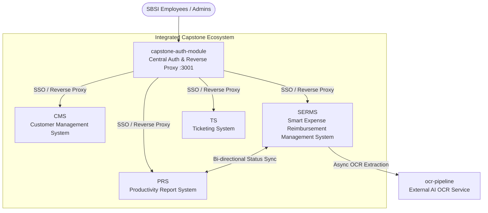
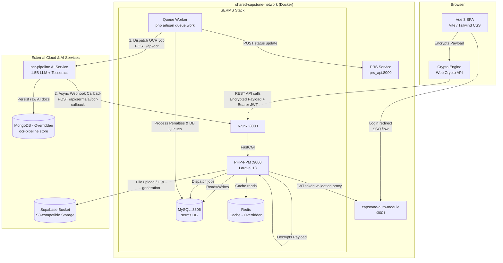
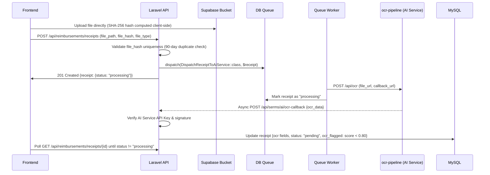

# SERMS Master Specification (Canonical Single Source of Truth)

**Project:** Smart Expense & Reimbursement Management System (SERMS)  
**Client / Partner:** Science Biotech Specialties Inc. (SBSI) — [https://sbsi.com.ph/about-us/](https://sbsi.com.ph/about-us/)  
**Academic Context:** 3rd & 4th Year Capstone Project (Capstone 1: Completed July 2026 · Capstone 2: September–December 2026)  
**Date:** 2026-09-01  
**Version:** 1.5.1  
**Owner:** SERMS Engineering & Architecture Council (Capstone Team)  
**Status:** Canonical Source of Truth  
**Last reconciled:** 2026-09-01 (Documentation suite refactor & standardization of 'What this is' sections across all docs)  
**Canonical Spec:** [SERMS.md](SERMS.md) · **Related Docs:** [index.md](index.md) · [PRD.md](PRD.md) · [SAD.md](SAD.md) · [SDD.md](SDD.md) · [DSD.md](DSD.md) · [Build.md](Build.md) · [OPS.md](OPS.md) · [QAD.md](QAD.md) · [CHANGELOG.md](CHANGELOG.md) · [AGENTS.md](../AGENTS.md)

---

> **What this is:** The canonical, authoritative Master Single Source of Truth for the Smart Expense & Reimbursement Management System (SERMS). It unifies product requirements (PRD), software architecture (SAD), modular system design and crypto protocols (SDD), clinical design system (DSD), build operations and agent guardrails (Build/AGENTS), cloud infrastructure (OPS), QA testing datasets (QAD), and historical context (CHANGELOG) into a single overarching reference. All other documentation files and code implementations derive from and must align with this document.

---

> [!IMPORTANT]
> **CANONICAL GOVERNANCE DIRECTIVE:**  
> This file (`docs/SERMS.md`) is the **primary, authoritative single source of truth** for the entire SERMS ecosystem. All human developers, AI agents, subagents, and downstream documentation guides (`PRD.md`, `SAD.md`, `SDD.md`, `DSD.md`, `Build.md`, `OPS.md`, `QAD.md`, `index.md`, and `AGENTS.md`) **MUST cross-reference this file first** before initiating any design, implementation, refactoring, or testing task. If any modification, architectural change, or requirement evolution is required, **this file must be updated first** before applying changes elsewhere.

---

## Table of Contents

1. [Document Read Order & Governance](#1-document-read-order--governance)
2. [Project & Client Background (SBSI & Capstone Ecosystem)](#2-project--client-background-sbsi--capstone-ecosystem)
3. [Client Server Constraints, AI Limits & Tech Decisions](#3-client-server-constraints-ai-limits--tech-decisions)
4. [Product Vision, Business Rules & Compliance (PRD)](#4-product-vision-business-rules--compliance-prd)
5. [Software Architecture & System Topology (SAD)](#5-software-architecture--system-topology-sad)
6. [System Design, Modules & Cryptography (SDD)](#6-system-design-modules--cryptography-sdd)
7. [Design System & Frontend UX Standards (DSD)](#7-design-system--frontend-ux-standards-dsd)
8. [Development, Build & Guardrail Conventions (Build & AGENTS)](#8-development-build--guardrail-conventions-build--agents)
9. [Operations, Reliability, Cloud & Azure Infra (OPS)](#9-operations-reliability-cloud--azure-infra-ops)
10. [Quality Assurance & Receipt Testing Guide (QAD)](#10-quality-assurance--receipt-testing-guide-qad)
11. [Changelog & Historical Context (CHANGELOG)](#11-changelog--historical-context-changelog)

---

## 1. Document Read Order & Governance

Every session, developer, and AI agent must ingest documentation in this exact sequence:

1. **`docs/SERMS.md`** *(This file — The Canonical Master Source of Truth)*
2. **`docs/CHANGELOG.md`** *(Historical context, ADRs, and change evolutions)*
3. **`docs/PRD.md`** *(Product requirements, workflows, and business compliance rules)*
4. **`docs/SAD.md`** *(Software architecture and modular monolith layering)*
5. **`docs/SDD.md`** *(System design, database ER diagram, crypto, and OCR pipeline)*
6. **`docs/DSD.md`** *(Design system, typography, 22-status badge map, and border rules)*
7. **`docs/OPS.md`** *(Operations runbook, Azure student budget, SLOs, and incident response)*
8. **`docs/QAD.md`** *(QA test plan, sample receipt datasets, and validation gates)*
9. **`docs/Build.md`** *(Build setup, golden path implementation patterns, and development guardrails)*
10. **`AGENTS.md`** *(Materialized developer & agent operational guide)*

---

## 2. Project & Client Background (SBSI & Capstone Ecosystem)

### 2.1 The Client: Science Biotech Specialties Inc. (SBSI)
- **Company Profile:** Science Biotech Specialties Inc. (SBSI) is a prominent healthcare and biotechnology solutions provider in the Philippines, delivering clinical laboratory diagnostics, medical devices, reagents, and technical field services.
- **Official Website:** [https://sbsi.com.ph/about-us/](https://sbsi.com.ph/about-us/)
- **Operational Need:** SBSI field engineers, sales representatives, and laboratory technicians regularly incur field travel and emergency procurement expenses. Manual paper-and-spreadsheet expense workflows create delays, tax non-compliance risks under Philippine Bureau of Internal Revenue (BIR) regulations, and untracked cash advance liquidations.

### 2.2 Academic Context & Turnover Mandate
- **Capstone Curriculum:** SERMS is developed as a core requirement for 3rd and 4th-year Computer Science / IT Capstone. The project requires partnering with a real-world enterprise client (SBSI), developing an integrated multi-system suite, deploying it to production infrastructure, and formally turning over the completed system to SBSI.
- **Timeline & Milestones:**
  - **Capstone 1 (Concluded July 2026):** Domain modeling, core modular monolith architecture, initial UI design, prototype OCR integration, and academic defense.
  - **Capstone 2 (September – December 2026):** Full multi-system ecosystem integration, deployment to Azure via `capstone-azure-infra`, user acceptance testing (UAT) with SBSI stakeholders, compliance verification, and final client turnover.

### 2.3 The Multi-System Capstone Ecosystem
SERMS operates as one of four integrated enterprise sub-systems designed for SBSI:

1. **CMS (Customer Management System):** Manages SBSI healthcare accounts, hospital/laboratory client profiles, contact points, and customer engagement histories.
2. **SERMS (Smart Expense Reimbursement Management System — This Project):** Automates reimbursement submissions, cash advance disbursements, OCR receipt parsing, BIR VAT classifications, advance liquidations, and overdue penalty assessments.
3. **PRS (Productivity Report System):** Tracks employee daily deliverables, field diagnostic schedules, and synchronizes reimbursement statuses for project cost accounting.
4. **TS (Ticketing System):** Manages customer service tickets, clinical diagnostic equipment maintenance requests, and technical escalation pipelines.
5. **Central Access Gateway (`capstone-auth-module`):** All sub-systems (CMS, SERMS, PRS, TS) can **only** be accessed through `capstone-auth-module`. It provides unified SSO, JWT token issuance, session validation, and reverse proxy routing.

---

## 3. Client Server Constraints, AI Limits & Tech Decisions

### 3.1 Client Server Permissions & Resource Constraints
SBSI granted permission for their on-premises / dedicated server to be used for hosting, with strict resource and architecture constraints:

| Constraint / Area | Client Specification / Permission | Status / SERMS Resolution |
|---|---|---|
| **AI Model Ceiling** | **Max 1.5B Parameters:** SBSI strictly capped local/embedded LLM execution to lightweight models (<= 1.5B parameters) to prevent GPU/CPU starvation on shared hardware. | **Enforced:** SERMS OCR extraction prompts and categorization models in `ocr-pipeline` strictly utilize lightweight <= 1.5B parameter models (e.g. Qwen 2.5 1.5B / SmolLM) paired with Tesseract OCR. |
| **Relational Database** | **MySQL Recommended:** SBSI recommended MySQL to match their existing internal systems. | **Approved / Aligned:** Core SERMS transactional database runs on MySQL 8.0 with pre-aggregated SQL queries. |
| **Frontend Framework** | **Vue Recommended:** SBSI standardizes internal frontend systems on Vue. | **Approved / Aligned:** SERMS client is built in Vue 3 (Composition API) with Pinia and Tailwind CSS. |
| **In-Memory Cache (Redis)** | **No Permission Granted:** SBSI did not grant official server permission for Redis. | **Overridden:** Containerized Redis is utilized in Docker for caching and queue acceleration. For strict client compliance upon turnover, SERMS maintains a transparent fallback to Laravel's MySQL Database cache/queue driver (`CACHE_STORE=database`, `QUEUE_CONNECTION=database`). |
| **NoSQL Database (MongoDB)** | **No Permission Granted:** SBSI did not grant official server permission for MongoDB. | **Overridden:** Utilized externally in the standalone `ocr-pipeline` AI service project for storing flexible JSON document schemas, raw OCR bounding boxes, and AI extraction logs. Core SERMS contains zero direct MongoDB dependencies. |

---

## 4. Product Vision, Business Rules & Compliance (PRD)

### 4.1 BIR VAT Rules & Financial Compliance
- **BIR VAT Validation:** Receipts must be strictly classified as **VAT** or **NON-VAT** based on Bureau of Internal Revenue (BIR) validation logic, never on unverified user input.
- **Immutable Auditing:** Append-only audit logs must be recorded for every financial mutation and retained for a minimum of 10 years. Updates and deletes on `audit_logs` and `penalties` tables are strictly forbidden.
- **Session Policies:** Standard user sessions timeout after 90 minutes; Admin/IT sessions timeout after 60 minutes. Concurrent sessions from distinct IP addresses are blocked.
- **No Hallucinations / No Fabrications:** Financial amounts, approval states, penalty calculations, and OCR outputs must never be guessed or fabricated. Missing fields require explicit clarification.

### 4.2 Functional Domain Workflows
- **Expense Reimbursement Submission:** User uploads receipts (JPEG, PNG, PDF <= 2MB). Files are uploaded to Supabase Bucket -> OCR Queue Job dispatches -> external AI processes receipt -> BIR VAT classification and 90-day duplicate check run -> user confirms and submits against an active cutoff period.
- **Cash Advance & Routing:** Employee submits purpose, amount, expected disbursement, and liquidation dates -> request routes through active `approval_thresholds` -> finance records disbursement reference -> status transitions to `unliquidated`.
- **Advance Liquidation & Variance:** Employee submits liquidation report with matching receipts -> variance computed -> excess cash returned or shortfall reimbursement claimed -> status marked `liquidated`.
- **Daily Overdue Penalties:** Nightly queued job scans unliquidated cash advances past their 7-day grace period -> applies configured daily penalty (PHP 50.00/day) -> writes immutable penalty records.
- **90-Day Duplicate Detection:** Receipts matching Vendor, Date, Total Amount, or Invoice Number within 90 days are flagged. Submitting an override requires a minimum 20-character justification and generates a dedicated audit log.

---

## 5. Software Architecture & System Topology (SAD)

SERMS follows a **Modular Monolith** architecture deployed within a containerized Docker network and integrated with cloud services.

---

## 6. System Design, Modules & Cryptography (SDD)

### 6.1 Module Roster (Canonical 9 Modules)

| Module | Route Prefix / Namespace | Key Controllers & Services | Key Jobs & Workers | Responsibility |
|---|---|---|---|---|
| **`CashAdvances`** | `/api/cash-advances` `App\Modules\CashAdvances` | `CashAdvanceController` `CashAdvanceService` | `CalculateOverdueCashAdvancesJob` | Lifecycle of cash advances: request, threshold verification, manager approval, disbursement logging, and acknowledgment. |
| **`Reimbursements`** | `/api/reimbursements` `App\Modules\Reimbursements` | `ReimbursementController` `ReceiptController` `ExpenseCategoryController` `PrsReimbursementRequestController` `PrsWebhookController` `OcrCallbackController` `ReimbursementService` `ReceiptService` | `UpdatePrsReimbursementStatusJob` `DispatchReceiptToAiService` | Reimbursement claim submission, multi-receipt uploading & OCR dispatch, 90-day duplicate checking, BIR VAT classification, PRS status sync, and approval workflows. |
| **`Expenses`** | `/api/expenses` `App\Modules\Expenses` | `ExpenseController` `ExpenseService` | — | Generic expense logging, line-item recording, receipt linkage, and expense category association. |
| **`Liquidations`** | `/api/liquidations` `App\Modules\Liquidations` | `LiquidationController` | `CalculateDailyPenaltiesJob` | Cash advance liquidation reports, receipt item matching & scanning, variance/shortfall computation, accounting audit verification, and daily penalty accruals. |
| **`AuditLogs`** | `App\Modules\AuditLogs` | `AuditLogService` | — | Centralized append-only audit trail logging (`AuditLogService::log()`) and compliance export action tracking. |
| **`Notifications`** | `App\Modules\Notifications` | `NotificationDeliveryService` | — | Template-based in-app notification dispatching, failed attempt logging, and role-based hierarchy resolution. |
| **`Ai`** | `App\Modules\Ai` | `AiServiceOcrEngine` `TesseractOcrEngine` | — | OCR contract bindings (`OcrEngineInterface`, `AsyncOcrEngineInterface`), external OCR service communication, payload signing, and webhook validation. |
| **`Users`** | `App\Modules\Users` | `User` Model & Providers | — | User identity mapping, department and organizational hierarchy resolution, and role policy checks. |
| **`Shared`** | `/api/crypto` `/api/auth` `App\Modules\Shared` | `CryptoController` `AuthController` `PayloadDecryptionService` `PasswordVerificationService` | — | Cryptographic public key distribution (`GET /api/crypto/key`), client payload pre-encryption decryption middleware (`DecryptPayloadMiddleware`), external auth SSO proxying (`/api/auth/me`), and password re-verification. |

### 6.2 Client-Side Pre-Encryption Architecture
To prevent shoulder theft, network snooping, and plaintext leakage of sensitive PII/financial mutations:
1. **Key Fetching:** Frontend fetches the RSA-OAEP public key from `GET /api/crypto/key`.
2. **Hybrid Encryption:** Client generates an ephemeral AES-256-GCM symmetric key, encrypts form inputs, and wraps the AES key with the RSA public key (`encrypted_payload` + `encrypted_key` + `iv`).
3. **Server-Side Decryption Middleware:** `DecryptPayloadMiddleware` intercepts incoming requests, decrypts payload fields transparently before reaching Form Requests, and binds plaintext data to `$request`.

### 6.3 Asynchronous OCR Pipeline Flow

---

## 7. Design System & Frontend UX Standards (DSD)

### 7.1 Cleanliness & Border Constraints
- **NO Colored Top Borders (`border-t-*`):** Colored top border accents, top accent lines, and bright border trims on cards, panels, or modals are **strictly prohibited** unless explicitly requested by the user.
- **Neutral, Clean Surfaces:** Cards and containers must maintain a clean, clinical, and subdued aesthetic using neutral backgrounds (`bg-white`, `dark:bg-slate-900`) and subtle gray borders (`border-slate-200`, `dark:border-slate-800`).

### 7.2 Typography System
- **Font Stack:** Primary font is Poppins / Montserrat (`var(--font-primary)`). Monospace is JetBrains Mono (`var(--font-mono)`).
- **Centralized Text Classes:**
  - Page Titles: `.text-page-title` (`text-xl sm:text-2xl font-bold font-heading text-slate-900 dark:text-white tracking-tight`)
  - Section Titles: `.text-section-title` (`text-sm font-semibold text-slate-900 dark:text-slate-100 uppercase tracking-wider font-heading`)
  - Field & Table Labels: `.text-field-label` (`text-[11px] font-medium text-slate-500 dark:text-slate-400 uppercase tracking-[0.02em]`)
  - Body Text: `.text-body` (`text-sm text-slate-600 dark:text-slate-300 font-sans leading-relaxed`)
  - Numerical Values: `.text-value` (`font-mono text-sm font-medium tabular-nums`)

### 7.3 Complete 23-Status Badge Map

| Status Key | Background Class | Display Label | Context |
|---|---|---|---|
| `approved` | `bg-emerald-500` | Approved | Approved advance, expense, or reimbursement |
| `granted` | `bg-emerald-600` | Granted | Cash advance granted |
| `paid` | `bg-emerald-700` | Paid | Reimbursement paid |
| `liquidated` | `bg-emerald-600` | Liquidated | Advance fully liquidated |
| `settled` | `bg-teal-600` | Settled | Account fully settled |
| `disbursed` | `bg-blue-600` | Disbursed | Funds disbursed by finance |
| `signed` | `bg-cyan-600` | Signed | Document / report signed |
| `processing` | `bg-sky-500` | Processing | In process / async queue handling |
| `processed` | `bg-sky-600` | Processed | Processing complete |
| `under-review` | `bg-violet-600` | Under Review | Review underway |
| `pending` | `bg-amber-500` | Pending | Awaiting action |
| `incomplete` | `bg-amber-600` | Incomplete | Additional info needed |
| `unliquidated` | `bg-amber-700` | Unliquidated | Disbursed but not liquidated |
| `overpayment` | `bg-rose-500` | Overpayment | Variance indicates overpayment |
| `overdue` | `bg-rose-600` | Overdue | Past 7-day grace period |
| `revise` | `bg-orange-500` | Needs Revision | Admin returned request for employee revision (counts toward 3-strike limit) |
| `rejected` | `bg-rose-600` | Rejected | Terminal rejection after >3 revise/reject cycles or final admin action |
| `reject` | `bg-rose-600` | Rejected | Direct reject (alias, increments revision counter) |
| `automatic-rejected` | `bg-rose-700` | Automatic Rejected | Policy/cutoff engine rejection |
| `final-rejected` | `bg-rose-800` | Final Rejected | Irreversible rejection |
| `pending-admin-re-review`| `bg-purple-600` | Pending Admin Re-Review | Re-submitted claim awaiting admin review |
| `draft` | `bg-slate-400` | Draft | Work in progress |
| `flagged` | `bg-orange-500` | Flagged | Flagged for OCR score `< 0.80` or duplicate check |

---

## 8. Development, Build & Guardrail Conventions (Build & AGENTS)

### 8.1 Pinned Tech Stack

| Layer | Technology | Version | Location / Config |
|---|---|---|---|
| Backend Runtime | PHP | `^8.3` | `apps/api/composer.json` |
| Backend Framework | Laravel | `^13.7` | `apps/api/` Monolith Core |
| Frontend Runtime | Node / Vue 3 | `^3.4.0` | `apps/web/package.json` |
| Frontend Styling | Tailwind CSS | `^3.4.3` | `apps/web/tailwind.config.js` |
| Icons | Lucide Vue Next | `^0.373.0` | Sourced dynamically in layouts |

### 8.2 Non-Negotiable Development Guardrails

1. **A-09 Fullstack Reusability & Anti-Duplication Rule:**
   - **Frontend:** Always scan `src/components/base/`, `src/composables/`, and utility files before writing new code. Reuse or extend existing abstractions. Create reusable modular components before writing inline one-off UI.
   - **Backend:** Check existing module controllers, actions, services, and queries before creating new routes. Reuse or extend existing endpoints rather than writing redundant routes or queries.
2. **Immutable Audit Logging:** Every database mutation (`create`, `update`, `delete`) and compliance export action must include an `AuditLogService::log()` call inside the same database transaction.
3. **Robust Boundary Error Handling:**
   - Explicit `try-catch` blocks must be placed at all system integration boundaries (Supabase S3 storage, OCR queue tasks, external HTTP APIs, filesystem I/O, background jobs).
   - Zero silent error swallowing: Always log actionable context and rethrow, map to structured domain exceptions, or return formatted HTTP 4xx/5xx responses.
   - Never swallow exceptions inside `DB::transaction()` blocks so rollbacks execute atomically.
   - Centralized exception delegation: Unhandled runtime errors bubble up to Laravel's Exception Handler (`bootstrap/app.php`) or Vue's global error handler.
4. **Client-Side Payload Encryption:** Pre-encrypt sensitive PII and financial mutations using Web Crypto API (`AES-256-GCM` + `RSA-OAEP`) before network submission.
5. **Database-Driven Analytics:** Dashboard analytics and reports must leverage raw SQL aggregation queries (`SUM`, `COUNT`, `GROUP BY`) rather than memory-heavy collection loops.
6. **Read-Only Git Inspection Rule:** AI agents are encouraged to inspect Git history (`git status`, `git log`, `git diff`) in read-only mode to gather context, but must NEVER write, commit, alter Git history, or push without explicit user permission.
7. **Context Gathering Before Action:** If a user's prompt or task lacks sufficient clarity or context, AI agents and developers must interview the user or ask clarifying questions via the `/grill-me` interface before proceeding.
8. **Cross-Project Access Rule for Sister Repositories:** AI agents and subagents are permitted to access, inspect, and search sister repositories (`capstone-auth-module`, `capstone-azure-infra`, `ocr-pipeline`, `CMS`, `PRS`, `TS`) in **read and search mode only** (`view_file`, `grep_search`, `list_dir`) for additional architecture or integration context. Agents must **NEVER modify, write, delete, or push code to any other repository** without explicit user permission.
9. **Documentation Change Log Rule:** Every documentation change in `docs/` or `documentations/` must be recorded in `docs/CHANGELOG.md`.
10. **Proactive Skill & Workflow Ingestion (`.agents/skills/`):** AI agents and subagents must actively check and leverage applicable skills from `.agents/skills/` (and built-in skills) before executing specialized tasks. When authoring features or bug fixes, utilize `test-driven-development`; for investigating errors or unexpected behavior, invoke `systematic-debugging`; for exploring requirements or creative design, use `brainstorming`; for multi-step implementation tasks, follow `writing-plans` and `executing-plans`; and before claiming completion, always invoke `verification-before-completion`. Agents must read the relevant `SKILL.md` before proceeding.
11. **Judicious Browser Testing (`browser_subagent`):** AI agents must use `browser_subagent` and browser-driven testing judiciously and **only when strictly applicable** (e.g., complex multi-step interactive workflows, visual regression, or interactive modal flows that cannot be verified faster via automated component/unit tests). Avoid launching slow browser subagents for simple UI tweaks, logic edits, or non-visual tasks where faster local verification suffices.
12. **Medium Date Formatting Standard (AI & Subagent Rule):** Whenever creating, displaying, or formatting human-readable dates across UI components, templates, notifications, documentation, or subagent conversational responses, AI subagents and developers must always use the **Medium Date Format** (e.g., `Sept 1, 2026`, `Oct 14, 2026`, `Jan 15, 2026`) instead of numerical or raw ISO formats (such as `2026-09-01` or `09/01/2026`). Internal database storage retains standard ISO `YYYY-MM-DD`, while all human-facing presentation layers strictly employ the medium date format.
13. **Constructive Pushback & Logical Rigor Rule (Anti-Sycophancy):** AI agents and subagents must never practice sycophancy or blindly agree with user prompts, opinions, or instructions. If a user request, proposed design, architectural direction, or implementation approach is flawed, suboptimal, violates project axioms (e.g., A-09 reusability, BIR compliance, audit immutability), or introduces technical debt, the agent MUST actively push back, articulate the exact logical reasoning and architectural risks, and propose an evidence-backed alternative. Every pushback, critique, or technical recommendation must have a clear, verifiable logical basis and cite relevant code, system constraints, or industry standards—never baseless disagreement or performative objection.

---

## 9. Operations, Reliability, Cloud & Azure Infra (OPS)

### 9.1 Cloud Deployment & `capstone-azure-infra`
Deployment of SERMS and its sister projects is managed via the **`capstone-azure-infra`** repository:
- **Cloud Provider:** Microsoft Azure.
- **Subscription Tier:** **Azure for Students** with a dedicated **$100 USD/year** credit envelope.
- **Deployed Services via `capstone-azure-infra`:**
  1. `SERMS` (Laravel 13 Monolith + Vue 3 Client + MySQL + Redis worker)
  2. `capstone-auth-module` (Central Authentication Service & Reverse Proxy)
  3. `ocr-pipeline` (Asynchronous OCR processing engine with Tesseract + 1.5B LLM)
- **Cost Optimization Strategies:** Containerized workloads use lightweight Alpine base images; idle compute is scaled down; background jobs are batch-processed via queue workers.

### 9.2 Service Level Objectives (SLOs)
- **Availability:** **99.5%** monthly uptime for API and web clients.
- **Latency (p95):** **< 300ms** for standard API endpoints.
- **OCR Processing Speed:** **< 10 seconds** for 90% of receipt uploads (upload to webhook callback).
- **Error Rate:** **< 0.1%** overall 5xx request error rate.

### 9.3 Incident Severity Ladder
- **P0 — Critical (< 15 min response):** Core API outage, authentication service unreachable, audit verification failure.
- **P1 — High (< 1 hr response):** OCR queue halted, Supabase storage unreachable, encryption key decryption failures.
- **P2 — Medium (< 4 hr response):** Non-critical service issues (notification delays, chart rendering glitch).
- **P3 — Low (Next business day):** Minor cosmetic alignment or reporting export formatting discrepancies.

---

## 10. Quality Assurance & Receipt Testing Guide (QAD)

### 10.1 Coverage Targets
- Backend Unit Tests: **80% overall**, **95%+** on critical compliance math (penalties, VAT validation, duplicate checks, audit logs).
- Frontend Unit Tests: Vitest + Vue Test Utils for component rendering and Pinia store mutations.
- Integration & E2E: PHPUnit API endpoint tests and Cypress/Playwright critical path user flows.

### 10.2 Sample Receipts Fixture Dataset Catalog
A curated set of real-world receipt image fixtures is located in **[`docs/receipts/`](receipts/)** for manual and automated upload validation:

| Fixture File | Location | Format / Size | Test Focus / Use Case |
|---|---|---|---|
| **Receipt 1** | [`docs/receipts/receipt 1.jpg`](receipts/receipt%201.jpg) | JPEG (~104 KB) | Standard commercial VAT official receipt (vendor name, TIN, date, VAT breakdown). |
| **Receipt 2** | [`docs/receipts/receipt 2.jpg`](receipts/receipt%202.jpg) | JPEG (~65 KB) | Thermal paper receipt / slanted angle (tests OCR noise tolerance & preprocessing filters). |
| **Receipt 3** | [`docs/receipts/receipt 3.jpg`](receipts/receipt%203.jpg) | JPEG (~204 KB) | High-resolution itemized expense slip (tests multi-line extraction and confidence scoring). |

### 10.3 Assertion Gates for AI Subagents & QA
1. **Storage & Hashing:** Uploaded receipt stored in Supabase Bucket; SHA-256 `file_hash` computed and persisted.
2. **Job Queuing:** `ProcessReceiptOcrJob` dispatched; vendor, date, amount, VAT, TIN, and invoice numbers extracted.
3. **Confidence Scoring:** `ocr_confidence_score` stored. If `< 0.80`, `ocr_flagged = true` is set and UI shows `[Low Confidence — Please Verify]`.
4. **Duplicate Detection:** Re-uploading within 90 days triggers duplicate warning and requires a 20+ character override justification.

---

## 11. Changelog & Historical Context (CHANGELOG)

All architectural decision records (ADRs), deprecations, additions, and modifications are documented chronologically in **[`docs/CHANGELOG.md`](CHANGELOG.md)**. Always review the Changelog when historical context or rationale for prior decisions is needed.

---

_SERMS Master Specification v1.3 — Governed by the SERMS Engineering & Architecture Council._
